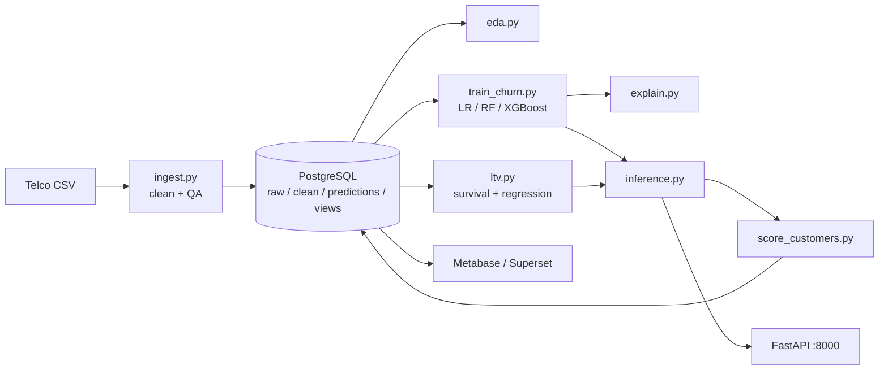

# Customer Churn Prediction & Lifetime Value (LTV) Engine

Predictive analytics system for telecom / subscription businesses. It ingests customer demographics,
billing and service data, **predicts who is about to churn**, **forecasts each customer's lifetime value**,
explains *why* with SHAP, serves everything through a **FastAPI** service, and publishes dashboards-ready
tables to **PostgreSQL** for **Metabase / Superset**.

**Stack:** Python - SQL - PostgreSQL - SQLAlchemy - Pandas - Scikit-Learn - XGBoost - SHAP - FastAPI - Seaborn - Metabase/Superset - Docker

## Architecture


## Quick start
### Docker (Postgres + pipeline + API + Metabase)
```bash
docker compose up --build
# API docs:  http://localhost:8000/docs      Metabase: http://localhost:3000
```
### Local
```bash
python -m venv .venv && source .venv/bin/activate && pip install -r requirements.txt
docker compose up -d db                 # or any PostgreSQL; set DATABASE_URL in .env
python -m src.pipeline                  # ingest -> eda -> train -> explain -> ltv -> score
uvicorn api.main:app --reload           # http://localhost:8000/docs
pytest -q
```
Run single stages: `python -m src.pipeline --steps train explain`.
The Telco CSV is bundled in `data/raw/` (auto-downloaded from the IBM repo if missing; also on Kaggle).

## Results (hold-out 20 % test set, 7,043 customers, 26.5 % churn)
| Model | Precision | Recall | F1 | ROC-AUC |
|---|---|---|---|---|
| Logistic Regression | 0.563 | 0.701 | 0.625 | 0.843 |
| **Random Forest (champion)** | 0.559 | 0.735 | **0.635** | **0.847** |
| XGBoost | 0.562 | 0.727 | 0.634 | 0.845 |

Threshold (~0.34) is tuned on out-of-fold predictions to maximise F1 (recall-leaning, since a missed churner is
costlier than a wasted offer); the champion is picked on CV only, never on the test set.
Top SHAP drivers: **contract type, tenure, internet service, payment method, average monthly spend**.
EDA: month-to-month churn 42.7 % vs 11.3 % (1-yr) vs 2.8 % (2-yr).
LTV regression (XGBoost): MAE about $17.8, R2 0.999 on the future-revenue target (see method note below).

## What's inside (mapped to the 4-week plan)
| Week | Deliverable | Where |
|---|---|---|
| 1 | PostgreSQL load, EDA (Pandas/Seaborn), missing values, encoding, baseline report | `src/ingest.py`, `src/eda.py`, `src/preprocessing.py`, `reports/eda/baseline_report.md` |
| 2 | Feature engineering, LR/RF/XGBoost, precision/recall/F1, SHAP | `src/features.py`, `src/train_churn.py`, `src/explain.py`, `reports/model/` |
| 3 | LTV regression models, FastAPI (single + batch) | `src/ltv.py`, `api/` |
| 4 | Dashboards (Superset/Metabase), Docker, docs | `sql/views.sql`, `docs/DASHBOARDS.md`, `Dockerfile`, `docker-compose.yml` |

**Engineered features:** average monthly spend vs base charge (`avg_monthly_spend`, `spend_vs_base_ratio`), add-on
service count, charge per service, autopay flag, family flag, tenure bucket.

## API
| Endpoint | Purpose |
|---|---|
| `POST /predict` | Single customer: churn probability, risk band, LTV, tier, priority, SHAP top drivers |
| `POST /predict/batch` | Up to 5,000 customers as JSON |
| `POST /predict/batch/csv` | Upload a Telco-format CSV |
| `GET /customers/{id}/risk` | Stored score from the warehouse |
| `GET /model/info`, `GET /health` | Model metadata / metrics, liveness |

```bash
curl -X POST localhost:8000/predict -H 'Content-Type: application/json' -d '{
 "gender":"Female","senior_citizen":0,"partner":"No","dependents":"No","tenure":1,"phone_service":"Yes",
 "multiple_lines":"No","internet_service":"Fiber optic","online_security":"No","online_backup":"No",
 "device_protection":"No","tech_support":"No","streaming_tv":"No","streaming_movies":"No",
 "contract":"Month-to-month","paperless_billing":"Yes","payment_method":"Electronic check","monthly_charges":80}'
```

## Business logic
* **Risk band:** Low < 0.30 <= Medium < 0.60 <= High (configurable in `.env`).
* **LTV tier:** quartiles of predicted LTV -> Bronze / Silver / Gold / Platinum.
* **Retention priority:** P1 *Retain now* = High risk & Gold/Platinum; P2 *Nurture* = Medium risk & Gold/Platinum, or High risk & Bronze/Silver; else P3 *Monitor*.
* **Revenue at risk** = predicted future revenue x churn probability.

## Method notes & limitations (please read)
* **LTV** = revenue collected so far (`total_charges`) + forecast future revenue over a 36-month horizon
  (`LTV_HORIZON_MONTHS`). The dataset has no future revenue label, so the regression target is
  `monthly_charges x expected remaining months`, where expected remaining months comes from a smoothed
  Kaplan-Meier survival curve per contract type. The regressor generalises this so new customers can be scored via
  the API. Its very high R2 therefore reflects how well it reproduces that constructed target, **not** validated
  forecasting of real future revenue. Validate against real billing history before using LTV for budgeting.
* SHAP explanations come from the XGBoost model; when the champion is Random Forest the probabilities and drivers come from
  different (but similarly performing) models.
* Models are trained on 80 % of the data and evaluated on the 20 % hold-out; scored customers include the training rows.
* Verified: full pipeline + 6 pytest tests against PostgreSQL 16 and SQLite. The Dockerfile / docker-compose / Metabase
  setup are provided but were not executed in the build environment.
* Dataset is public and synthetic-like (IBM sample); retrain on real data before production use.

## GitHub protocol
See `docs/GIT_WORKFLOW.md` (daily commits, branching, commit-message conventions and a day-by-day commit plan).
